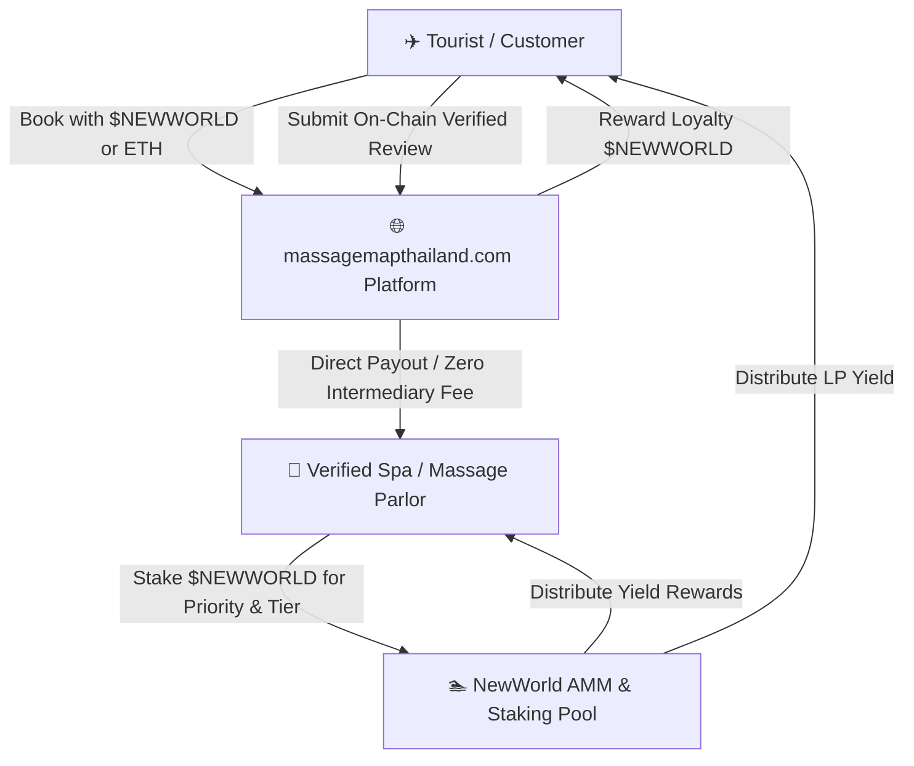
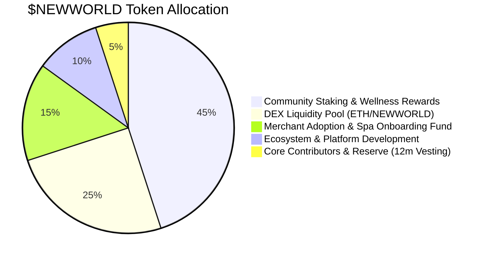

# 🌿 NewWorld Token ($NEWWORLD) & MassageMap Thailand Technical Whitepaper

**Official Ecosystem Token for [massagemapthailand.com](https://massagemapthailand.com)**  
*Decentralized Wellness Rewards, Tourism Loyalty, and Merchant Staking Protocol*

---

## 1. Executive Summary

Thailand is the premier global capital of traditional wellness and spa tourism, attracting over 35 million international visitors annually. However, the industry suffers from three major pain points:
1. **High Intermediary Fees:** Centralized booking platforms charge local spas and massage parlors 15%–30% in platform commissions.
2. **Foreign Exchange & Cross-Border Friction:** International tourists incur 3%–7% in foreign credit card transaction fees and unfavourable currency exchange rates.
3. **Fake & Manipulated Reviews:** Lack of verifiable on-chain proof of service leads to unreliable review systems.

**NewWorld Token ($NEWWORLD)** is the decentralized utility and governance token powering **MassageMap Thailand** ([massagemapthailand.com](https://massagemapthailand.com)). It bridges decentralized finance (DeFi) with real-world wellness services, enabling:
* **Zero-Fee Direct Bookings:** Direct customer-to-merchant crypto payments.
* **Review-to-Earn (R2E):** Cryptographically verified reviews rewarded in $NEWWORLD.
* **Merchant Quality Staking:** Spas stake $NEWWORLD to secure premium directory placement and verified provenance badges.
* **Tourism Staking Yield:** Tourists and liquidity providers earn passive yield from platform transaction volume.

---

## 2. Core Token Utilities & Platform Economy

### 2.1. Pay & Save (Zero-FX Tourism Checkout)
Tourists visiting Thailand can pay for massages, wellness retreats, and spa packages directly using $NEWWORLD, ETH, or stablecoins through the MassageMap Thailand Web3 booking engine. 
* **Benefits:** 10%–20% discount compared to fiat cash/credit prices.
* **Gasless Approvals:** Powered by EIP-2612 `permit` signatures—users approve and pay in one click without holding native ETH for token approvals.

### 2.2. Review-to-Earn (R2E) & Sybil Resistance
To eliminate fake reviews:
* Customers receive a unique non-transferable service voucher upon booking.
* After the massage session, submitting a verified review mints an on-chain verification hash and awards the customer bonus $NEWWORLD tokens.

### 2.3. Merchant Staking & Tiered Visibility
Massage shops and independent therapists across Bangkok, Chiang Mai, Phuket, and Pattaya stake $NEWWORLD tokens to unlock platform tiers:
* **Tier 1 (Explorer):** Basic listing on MassageMap Thailand.
* **Tier 2 (Verified Partner):** 5,000 $NEWWORLD staked → Verified blue badge, top 10 search priority in district.
* **Tier 3 (Master Spa & Wellness Center):** 25,000 $NEWWORLD staked → Featured hero placement, automated multi-language AI translation, and zero booking commission.

---

## 3. Tokenomics & Distribution

* **Token Name:** New World
* **Ticker Symbol:** `NEWWORLD`
* **Network:** Ethereum / EVM Layer-2 (Base, Arbitrum)
* **Standard:** ERC-20 + EIP-2612 Permit
* **Total Supply:** `1,000,000 NEWWORLD` (Fixed Cap)

| Allocation Bucket | Percentage | Token Amount | Release Schedule |
| :--- | :--- | :--- | :--- |
| **Community Staking & Rewards** | 45% | 450,000 NEW | Distributed linearly via AMM Yield Pool |
| **DEX Liquidity Pool** | 25% | 250,000 NEW | 100% unlocked for Uniswap/NewWorldPool seeding |
| **Merchant Onboarding Grants** | 15% | 150,000 NEW | 6-month milestone releases for verified spas |
| **Ecosystem & Platform Dev** | 10% | 100,000 NEW | 12-month linear vesting for massagemapthailand.com |
| **Core Team & Contributors** | 5% | 50,000 NEW | 12-month lockup, 6-month linear vesting |

---

## 4. Smart Contract Architecture

The NewWorld Protocol smart contract suite consists of two core audited components:

### 4.1. `NewWorldToken.sol` (ERC-20 + EIP-2612)
* **Contract Address:** `0x5FbDB2315678afecb367f032d93F642f64180aa3`
* **Features:**
  * Gasless `permit(address owner, address spender, uint256 value, uint256 deadline, uint8 v, bytes32 r, bytes32 s)`
  * 2-Step Ownership Transfer (`transferOwnership` + `acceptOwnership`)
  * Emergency Pause Switch (`pause()` / `unpause()`)

### 4.2. `NewWorldPool.sol` (AMM + Staking Engine)
* **Contract Address:** `0xe7f1725E7734CE288F8367e1Bb143E90bb3F0512`
* **Features:**
  * Constant product pricing model: $(x \cdot y = k)$ with $0.3\%$ liquidity fee.
  * Real-time yield index tracking: $\text{accRewardPerShare}$ updated on every interaction.
  * Reentrancy guard protected.

---

## 5. Roadmap

* **Phase 1 (Q3 2026): Foundation & Protocol Launch**
  * Deploy audited smart contracts & liquidity pool.
  * Launch interactive DApp and web3 booking widget on `massagemapthailand.com`.
  * Listing application on CoinMarketCap, CoinGecko, and DexScreener.

* **Phase 2 (Q4 2026): Merchant Onboarding in Thailand**
  * Onboard first 250 verified spa partners across Bangkok (Sukhumvit, Silom), Chiang Mai, and Phuket.
  * Launch Review-to-Earn (R2E) mobile web check-in.

* **Phase 3 (Q1 2027): Cross-Chain & Tourism Expansion**
  * Deploy on Base / Arbitrum for sub-cent gas fees.
  * Integrate Apple Pay / Google Pay fiat on-ramp directly inside `massagemapthailand.com`.

---

## 6. Official Links & Community Channels

* **Official Website:** [https://massagemapthailand.com](https://massagemapthailand.com)
* **DApp & Liquidity Pool:** [http://127.0.0.1:8545](http://127.0.0.1:8545) / `massagemapthailand.com/dapp`
* **Smart Contract Audit:** Audited via Eth-Hunter Autonomous Engine
* **Support & Contact:** `team@massagemapthailand.com`
