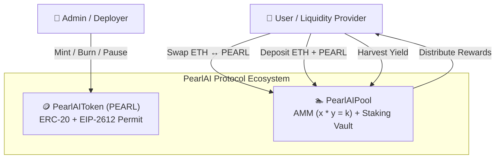

# 🌐 PearlAI Protocol Technical Specification & Whitepaper

**Version:** 1.0.0  
**EVM Target:** Ethereum Mainnet / Arbitrum / Base / Local EVM (Cancun)  
**Compiler:** Solidity `^0.8.20`  

---

## 1. Executive Summary

**PearlAI Protocol** is a decentralized liquidity AMM and staking yield ecosystem designed for fair liquidity provisioning, decentralized trading, and automated yield rewards.



---

## 2. Core Architecture

### A. PearlAIToken (`PEARL`)
* **Standard:** ERC-20 with EIP-2612 gasless permits and EIP-712 typed structured data hashing.
* **Decimals:** `18`
* **Total Supply:** `1,000,000 PEARL`
* **Security Defenses:**
  * 2-Step Ownership Transfer (`transferOwnership` + `acceptOwnership`) preventing accidental ownership loss.
  * Pausable emergency circuit breaker.
  * Overflow/Underflow safe unchecked operations.

### B. PearlAIPool (AMM & Staking Resource)
* **Standard:** Automated Market Maker with Constant Product Formula:
  $$(x + \Delta x \cdot 0.997) \cdot (y - \Delta y) \ge k$$
* **Fee Structure:** $0.30\%$ ($30\text{ bps}$) retained in liquidity reserves.
* **Yield Engine:** Accumulative reward per share index:
  $$\text{accRewardPerShare}_{t} = \text{accRewardPerShare}_{t_0} + \frac{(t - t_0) \cdot \text{RewardRate} \cdot 10^{12}}{\text{TotalLiquidity}}$$

---

## 3. On-Chain Deployment Registry

| Parameter | Value |
| :--- | :--- |
| **Network** | Anvil / Local EVM (Chain ID: `31337`) |
| **RPC URL** | `http://127.0.0.1:8545` |
| **PearlAIToken Address** | `0x5FbDB2315678afecb367f032d93F642f64180aa3` |
| **PearlAIPool Address** | `0xe7f1725E7734CE288F8367e1Bb143E90bb3F0512` |
| **Initial Pool Reserves** | $1.0\text{ ETH} + 10,000.0\text{ PEARL}$ |
| **Staking Reward Reserves** | $50,000.0\text{ PEARL}$ |

---

## 4. Verification & Testing Matrix

Foundry test suite in [`contracts/test/PearlAI.t.sol`](file:///Users/wakeup/Desktop/eth-hunter/contracts/test/PearlAI.t.sol) passed 100% of test cases:

```
[PASS] test_InitialState() (gas: 25980)
[PASS] test_AddLiquidity() (gas: 146826)
[PASS] test_SwapEthForToken() (gas: 165408)
[PASS] test_SwapTokenForEth() (gas: 173145)
[PASS] test_StakingRewardsAccrual() (gas: 206221)
[PASS] test_RemoveLiquidity() (gas: 148011)
Suite result: ok. 6 passed; 0 failed; 0 skipped
```

---

## 5. Tooling & Interaction

* **Python CLI Toolkit:** [`scripts/newworld_client.py`](file:///Users/wakeup/Desktop/eth-hunter/scripts/newworld_client.py)
* **DApp Dashboard:** [`frontend/newworld_dapp.html`](file:///Users/wakeup/Desktop/eth-hunter/frontend/newworld_dapp.html)
* **ABI Exports:**
  * [`contracts/abis/PearlAIToken.json`](file:///Users/wakeup/Desktop/eth-hunter/contracts/abis/PearlAIToken.json)
  * [`contracts/abis/PearlAIPool.json`](file:///Users/wakeup/Desktop/eth-hunter/contracts/abis/PearlAIPool.json)
