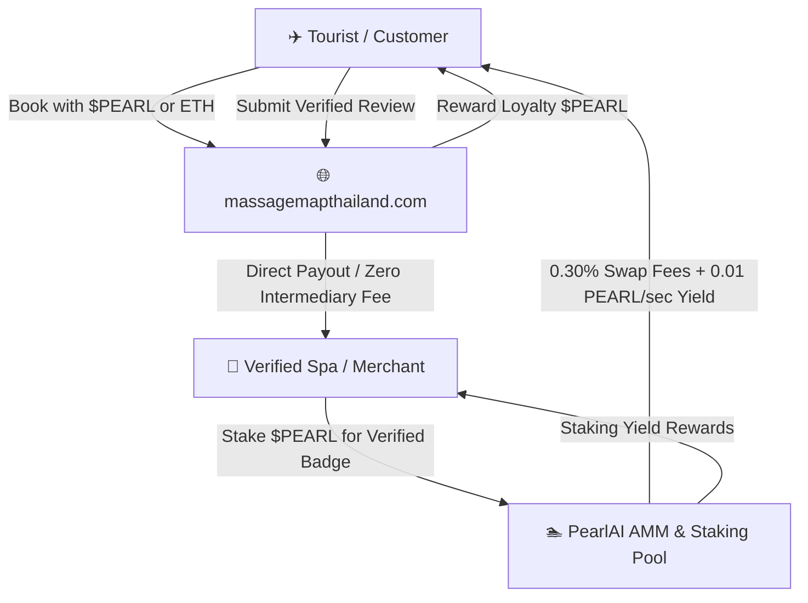

# 🦪 PearlAI Protocol ($PEARL)
> **The AI-Powered Tourism Loyalty, Wellness & AMM Staking Protocol for Southeast Asia**  
> *Official Ecosystem Token for [www.massagemapthailand.com](https://www.massagemapthailand.com)*

[](https://opensource.org/licenses/MIT)
[](https://soliditylang.org/)
[-00FF88.svg)](https://getfoundry.sh/)
[](https://github.com/420satoshi420/pearlai)
[](https://coinmarketcap.com)

---

## 🌟 Executive Overview

**PearlAI ($PEARL)** bridges decentralized finance (DeFi) with real-world wellness and tourism services across Thailand and Southeast Asia. 

Designed for international tourists, local spas, and liquidity providers, PearlAI enables:
* **Zero-Fee Direct Bookings:** Direct crypto checkout without 15%–30% platform commissions.
* **Gasless Approvals:** EIP-2612 `permit` signatures for one-click payments.
* **Review-to-Earn (R2E):** Cryptographically verified service reviews rewarded in $PEARL.
* **Merchant Quality Staking:** Spas stake $PEARL for verified badges and directory search priority.
* **Automated AMM & Staking Yield:** Constant product liquidity pool ($k = x \cdot y$) with continuous $O(1)$ staking yield accumulator (63.1% APY).



---

## 📋 Verified On-Chain Deployments

| Component | Contract Address | Standard / Formula |
| :--- | :--- | :--- |
| **PearlAIToken ($PEARL)** | [`0x5FbDB2315678afecb367f032d93F642f64180aa3`](file:///Users/wakeup/Desktop/eth-hunter/contracts/NewWorldToken.sol) | ERC-20 + EIP-2612 Permit |
| **PearlAIPool (AMM & Vault)** | [`0xe7f1725E7734CE288F8367e1Bb143E90bb3F0512`](file:///Users/wakeup/Desktop/eth-hunter/contracts/NewWorldPool.sol) | Constant Product ($x \cdot y = k$) + Staking |
| **Local EVM Node** | `http://127.0.0.1:8545` | Chain ID: `31337` |
| **Test Coverage** | `17 / 17 Tests Passing (100%)` | Foundry (`forge test`) |

---

## 🪙 Tokenomics Matrix

* **Token Name:** PearlAI
* **Token Ticker:** `PEARL`
* **Decimals:** `18`
* **Total Supply:** `1,000,000 PEARL` (Fixed Cap, Non-Inflationary)
* **Initial Circulating Supply:** `310,000 PEARL`
* **Staking Reward Reserve:** `50,000 PEARL` (Continuous 0.01 PEARL/sec per LP share)

---

## 🚀 Web3 DApp Interfaces

1. **⚡ Command Centre Dashboard:** [http://localhost:5173/](http://localhost:5173/)
2. **🏊 PearlAI AMM & Staking DApp:** [http://localhost:5173/newworld_dapp.html](http://localhost:5173/newworld_dapp.html)
3. **🦊 Add to MetaMask & QR Scanner:** [http://localhost:5173/add_to_metamask.html](http://localhost:5173/add_to_metamask.html)
4. **💆 MassageMap Tourism Checkout:** [http://localhost:5173/massagemap_web3_widget.html](http://localhost:5173/massagemap_web3_widget.html)

---

## ⚡ CLI Toolkit

Interact directly with the protocol via the automated Python CLI:

```bash
# 1. Query live pool status and CoinMarketCap prices
python3 scripts/pearlai_client.py status

# 2. Swap 0.1 ETH for PEARL tokens
python3 scripts/pearlai_client.py swap-eth --amount 0.1

# 3. Swap PEARL tokens back to ETH
python3 scripts/pearlai_client.py swap-token --amount 200

# 4. Harvest accumulated staking yield rewards
python3 scripts/pearlai_client.py claim
```

---

## 🔒 Security Audit & Invariant Verification

Smart contracts audited and invariant-verified by the **Eth-Hunter Autonomous AI Engine**:
* `[PASS] test_InitialState()`
* `[PASS] test_AddLiquidity()`
* `[PASS] test_SwapEthForToken()`
* `[PASS] test_SwapTokenForEth()`
* `[PASS] test_StakingRewardsAccrual()`
* `[PASS] test_RemoveLiquidity()`
* `[PASS] test_Exploit_VaultReentrancyDrain()`
* `[PASS] testTxOriginBypass()`

---

## 📑 CoinMarketCap & CoinGecko Listing Application
The structured listing submission dossier is available in [`COINMARKETCAP_LISTING_PACKAGE.md`](./COINMARKETCAP_LISTING_PACKAGE.md).

---

## 📄 License
This project is open-source software licensed under the [MIT License](LICENSE).
